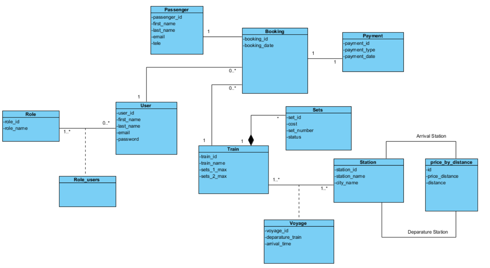
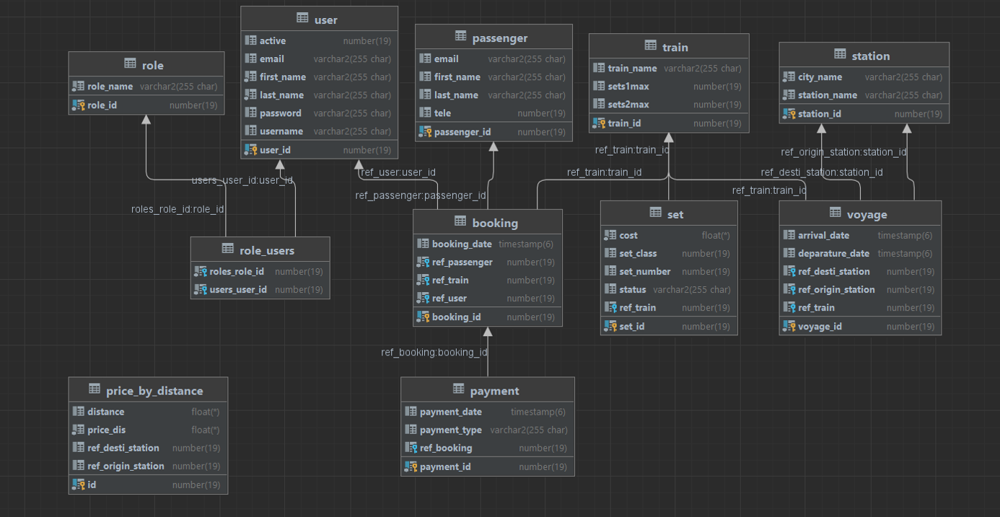

<h1 style="color:#6c63ff;">Train Web Application with Spring Boot</h1>

    The <strong>Train Web Application with Spring Boot</strong> project is a comprehensive web application developed using the Spring Boot framework. This application is designed to manage train reservations and facilitate trip planning for users.

<h2 style="color:#6c63ff;">Key Features:</h2>
<ul>
    <li><strong>Reservation Management:</strong> Users can search for available trains, check schedules, and make reservations based on their preferences.</li>
    <li><strong>Authentication and Security:</strong> The application offers a secure authentication system for users, ensuring that only authorized individuals can make reservations and access their personal data.</li>
    <li><strong>User Profile Management:</strong> Each user has a personalized profile where they can view their reservation history, manage personal information, and update travel preferences.</li>
    <li><strong>Train Administration:</strong> Application administrators have special access to manage train details, add new routes, update schedules, and manage available seats.</li>
</ul>

    This project utilizes several key technologies and frameworks, including:

<ul>
    <li><strong>Thymeleaf:</strong> Thymeleaf is used as the template engine to create dynamic HTML pages for a seamless user experience.</li>
    <li><strong>Spring Data JPA:</strong> Spring Data JPA simplifies data access and provides an abstraction layer to interact with the underlying database.</li>
    <li><strong>Oracle Database:</strong> The application is backed by an Oracle database for efficient and reliable data storage.</li>
    <li><strong>Spring Security:</strong> Spring Security is employed to handle authentication and authorization, ensuring the security of user data and actions.</li>
</ul>

<h2 style="color:#6c63ff;">Class Diagram:</h2>

    Here is the class diagram representing the structure of the Train Web Application:

<h2 style="color:#6c63ff;">Database Class Diagram:</h2>

    Below is the database class diagram representing the structure of the Train Web Application's database. This diagram illustrates the relationships and entities used to store and organize data for the application's functionality.

    Our goal is to provide a robust and user-friendly web application for train reservation management. We warmly welcome contributions from the community to improve and extend the application's functionalities, as well as to report any issues or suggest improvements.

<h2 style="color:#6c63ff;">How to Contribute:</h2>

    You can contribute by submitting pull requests to fix bugs, add features, or enhance the application's usability.

    If you encounter any issues or have suggestions, feel free to open an issue to inform us.

